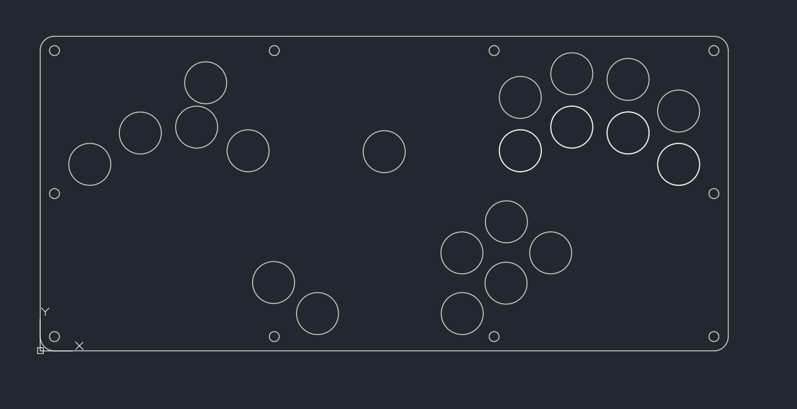
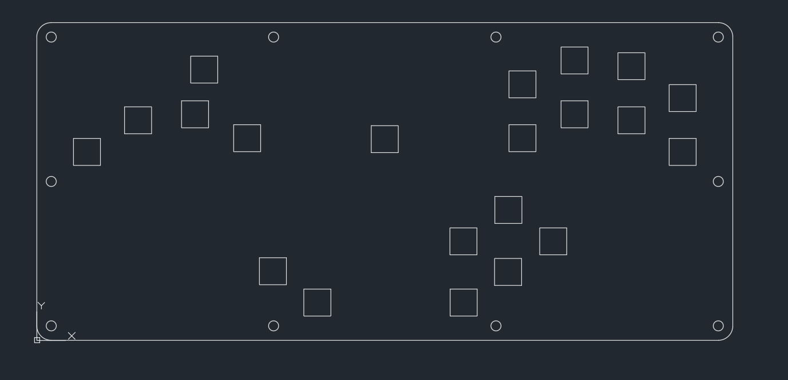
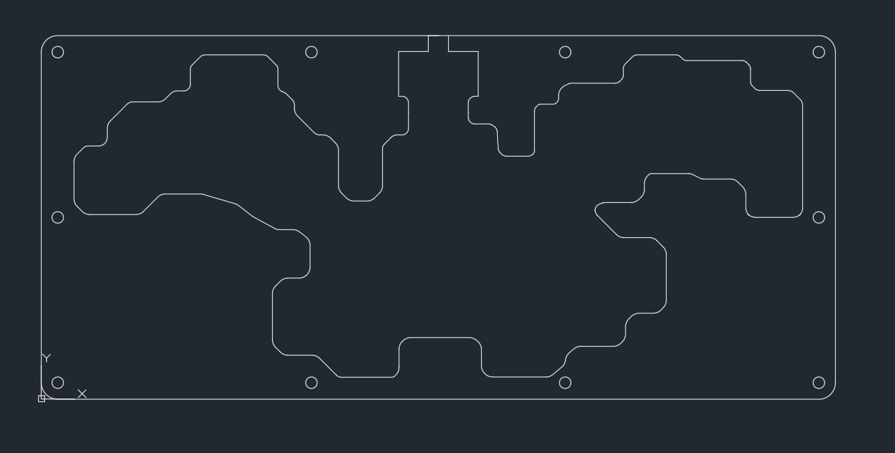
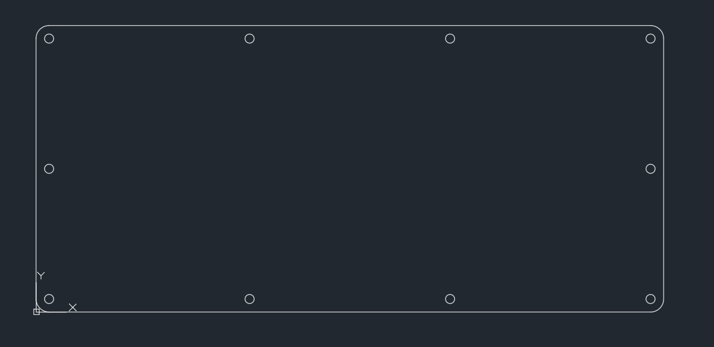

# Kaif Box

## Description

This is uzi's design, I just added another up button and place for aliexpress usb-c breakout board. Also I changed screw holes so you can use bolts with regular nuts (not T-nuts)

## 7 layers of 3 mm lasercut acrylic

3xtop layer (optional)

1xswitchplate

2xmiddle layer

1xbottom plate

## Dimensions:

Length: 360.68mm

Width: 165.10mm

Height: 21mm

## Parts List:

Raspberry Pi Pico 

21 mx style switches

21 bjartcaps (can find them here https://github.com/rana-sylvatica/circle-keycaps)

Female usb-c breakout board  (https://sl.aliexpress.ru/p?key=bqGpU5M)

Wire

10 m5 25mm screws
(https://www.aliexpress.com/item/1005003258556816.html?spm=a2g0o.order_list.0.0.27161802PMt7pe)

10 m5 nuts
